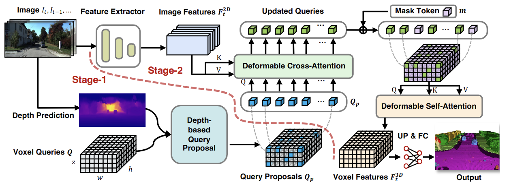

<div align="center">   
  
# VoxFormer: a Cutting-edge Baseline for 3D Semantic Occupancy Prediction
</div>


> **VoxFormer: Sparse Voxel Transformer for Camera-based 3D Semantic Scene Completion**, CVPR 2023.

> [Yiming Li](https://scholar.google.com/citations?hl=en&user=i_aajNoAAAAJ&view_op=list_works&sortby=pubdate), [Zhiding Yu](https://scholar.google.com/citations?user=1VI_oYUAAAAJ&hl=en), [Chris Choy](https://scholar.google.com/citations?user=2u8G5ksAAAAJ&hl=en), [Chaowei Xiao](https://scholar.google.com/citations?user=Juoqtj8AAAAJ&hl=en), [Jose M. Alvarez](https://scholar.google.com/citations?user=Oyx-_UIAAAAJ&hl=en), [Sanja Fidler](https://scholar.google.com/citations?user=CUlqK5EAAAAJ&hl=en), [Chen Feng](https://scholar.google.com/citations?user=YeG8ZM0AAAAJ&hl=en), [Anima Anandkumar](https://scholar.google.com/citations?user=bEcLezcAAAAJ&hl=en)

>  [[PDF]](https://arxiv.org/pdf/2302.12251.pdf) [[Project]](https://github.com/NVlabs/VoxFormer) [[Intro Video]](https://youtu.be/KEn8oklzyvo?si=k2V4c22MCCvu9zFr) 


## News
- [2023/07]: We release the code of voxformer with 3D deformable attention module, achieving slightly better performance. 
- [2023/06]: 🔥 We release [SSCBench](https://github.com/ai4ce/SSCBench), a large-scale semantic scene completion benchmark derived from KITTI-360, nuScenes, and Waymo. 
- [2023/06]: Welcome to our CVPR poster session on 21 June (**WED-AM-082**), and check our [online video](https://www.youtube.com/watch?v=L0M9ayR316g).
- [2023/03]: 🔥 VoxFormer is accepted by [CVPR 2023](https://cvpr2023.thecvf.com/) as a highlight paper **(235/9155, 2.5% acceptance rate)**.
- [2023/02]: Our paper is on [arxiv](https://arxiv.org/abs/2302.12251).
- [2022/11]: VoxFormer achieve the SOTA on [SemanticKITTI 3D SSC (Semantic Scene Completion) Task](http://www.semantic-kitti.org/tasks.html#ssc) with **13.35% mIoU** and **44.15% IoU** (camera-only)!
</br>


## Abstract
Humans can easily imagine the complete 3D geometry of occluded objects and scenes. This appealing ability is vital for recognition and understanding. To enable such capability in AI systems, we propose VoxFormer, a Transformer-based semantic scene completion framework that can output complete 3D volumetric semantics from only 2D images. Our framework adopts a two-stage design where we start from a sparse set of visible and occupied voxel queries from depth estimation, followed by a densification stage that generates dense 3D voxels from the sparse ones. A key idea of this design is that the visual features on 2D images correspond only to the visible scene structures rather than the occluded or empty spaces. Therefore, starting with the featurization and prediction of the visible structures is more reliable. Once we obtain the set of sparse queries, we apply a masked autoencoder design to propagate the information to all the voxels by self-attention. Experiments on SemanticKITTI show that VoxFormer outperforms the state of the art with a relative improvement of 20.0% in geometry and 18.1% in semantics and reduces GPU memory during training by ~45% to less than 16GB.


## Method

|  | 
|:--:| 
| ***Figure 1. Overall framework of VoxFormer**. Given RGB images, 2D features are extracted by ResNet50 and the depth is estimated by an off-the-shelf depth predictor. The estimated depth after correction enables the class-agnostic query proposal stage: the query located at an occupied position will be selected to carry out deformable cross-attention with image features. Afterwards, mask tokens will be added for completing voxel features by deformable self-attention. The refined voxel features will be upsampled and projected to the output space for per-voxel semantic segmentation. Note that our framework supports the input of single or multiple images.* |

## Getting Started
- [Installation](docs/install.md) 
- [Prepare Dataset](docs/prepare_dataset.md)
- [Run and Eval](docs/getting_started.md)

## Model Zoo
The query proposal network (QPN) for stage-1 is available [here](https://drive.google.com/file/d/1NzN6eqCnuxzau0m_N9B02Q2zwLBKhnBp/view?usp=share_link).
For stage-2, please download the trained models based on the following table.

| Backbone | Method | Lr Schd | IoU| mIoU | Config | Download |
| :---: | :---: | :---: | :---: | :---:| :---: | :---: |
| [R50](https://drive.google.com/file/d/1A4Efx7OQ2KVokM1XTbZ6Lf2Q5P-srsyE/view?usp=share_link) | VoxFormer-T | 20ep | 44.15| 13.35|[config](projects/configs/voxformer/voxformer-T.py) |[model](https://drive.google.com/file/d/1KOYN3MGHMyCTDZWw4lNNicCdImnKqvlz/view?usp=share_link) |
| [R50](https://drive.google.com/file/d/1A4Efx7OQ2KVokM1XTbZ6Lf2Q5P-srsyE/view?usp=share_link) | VoxFormer-S | 20ep | 44.02| 12.35|[config](projects/configs/voxformer/voxformer-S.py) |[model](https://drive.google.com/file/d/1UBemF77Cfr0d9rcC_Y9Qmjnqp_c4qoeb/view?usp=share_link)|
| [R50](https://drive.google.com/file/d/1A4Efx7OQ2KVokM1XTbZ6Lf2Q5P-srsyE/view?usp=share_link) | VoxFormer-T-3D | 20ep | 44.35| 13.69|[config](projects/configs/voxformer/voxformer-T_deform3D.py) |[model](https://drive.google.com/file/d/1JQwaO5XXMMkTcF95tCHk45q6PzZnofS6/view?usp=drive_link)|
| [R50](https://drive.google.com/file/d/1A4Efx7OQ2KVokM1XTbZ6Lf2Q5P-srsyE/view?usp=share_link) | VoxFormer-S-3D | 20ep | 44.42| 12.86|[config](projects/configs/voxformer/voxformer-S_deform3D.py) |[model](https://drive.google.com/file/d/1kwcMGRl9FOprV2k5kqCS0kfvrbCfJMcZ/view?usp=drive_link)|

 
## Dataset

- [x] SemanticKITTI
- [ ] KITTI-360
- [ ] nuScenes

## Bibtex
If this work is helpful for your research, please cite the following BibTeX entry.

```
@InProceedings{li2023voxformer,
      title={VoxFormer: Sparse Voxel Transformer for Camera-based 3D Semantic Scene Completion}, 
      author={Li, Yiming and Yu, Zhiding and Choy, Christopher and Xiao, Chaowei and Alvarez, Jose M and Fidler, Sanja and Feng, Chen and Anandkumar, Anima},
      booktitle = {Proceedings of the IEEE/CVF Conference on Computer Vision and Pattern Recognition (CVPR)},
      year={2023}
}
```

## License
Copyright © 2022-2023, NVIDIA Corporation and Affiliates. All rights reserved.

This work is made available under the Nvidia Source Code License-NC. Click [here](https://github.com/NVlabs/VoxFormer/blob/main/LICENSE) to view a copy of this license.

The pre-trained models are shared under [CC-BY-NC-SA-4.0](https://creativecommons.org/licenses/by-nc-sa/4.0/). If you remix, transform, or build upon the material, you must distribute your contributions under the same license as the original.

For business inquiries, please visit our website and submit the form: [NVIDIA Research Licensing](https://www.nvidia.com/en-us/research/inquiries/).

## Star History

[](https://star-history.com/#NVlabs/VoxFormer)

## Acknowledgement

Many thanks to these excellent open source projects:
- [BEVFormer](https://github.com/fundamentalvision/BEVFormer)
- [mmdet3d](https://github.com/open-mmlab/mmdetection3d)
- [MonoScene](https://github.com/astra-vision/MonoScene)
- [LMSCNet](https://github.com/astra-vision/LMSCNet)
- [semantic-kitti-api](https://github.com/PRBonn/semantic-kitti-api) 
- [MobileStereoNet](https://github.com/cogsys-tuebingen/mobilestereonet)
- [Pseudo_Lidar_V2](https://github.com/mileyan/Pseudo_Lidar_V2)
- [wysiwyg](https://github.com/peiyunh/wysiwyg)
